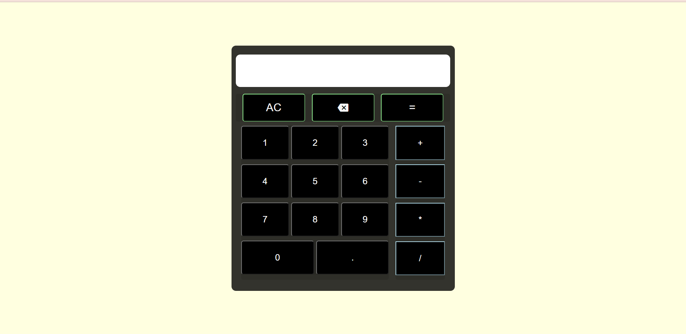

# calculator

Deployed Link: https://aayushkshrivastava.github.io/calculator/

Users can perform basic arithmetic operations using both on screen and physical keyboard.

I wrote the HTML, JavaScript, and CSS code for this project. While completing this project leaned to establish synchronisation between on screen and physical keyboard. This project also helped me polish my DOM manipulation skills. I also got to use various event listeners like keypress, keydown.
